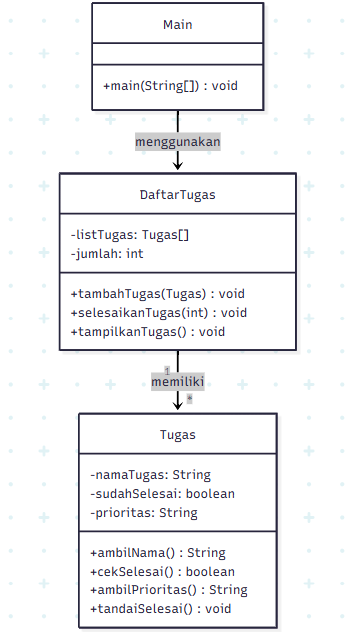
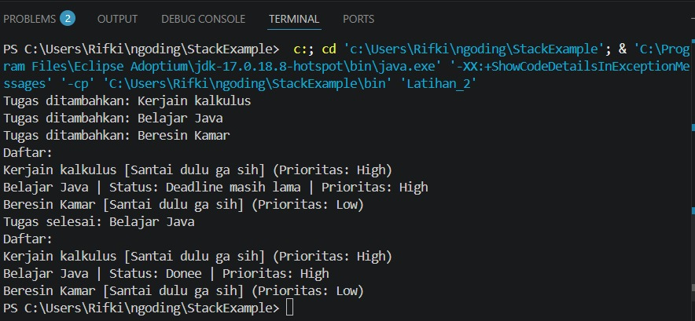

## Deskripsi Kasus
Permasalahan yang sering muncul adalah kesulitan dalam mengelola dan memantau tugas-tugas tersebut. Banyak siswa hanya mengandalkan ingatan atau mencatat secara manual, yang sering kali menyebabkan beberapa tugas terlupakan, tidak terselesaikan tepat waktu, atau tidak terorganisir dengan baik. Program ini dibuat untuk membantu saya dalam mencatat daftar tugas sehari-hari, program ini juga mengimplementasikan keempat pilar utama OOP, yaitu encapsulation, abstraction, inheritance, dan polymorphism. Hal ini bertujuan agar kode yang dibuat tidak hanya berfungsi dengan baik, tetapi juga mengikuti prinsip desain perangkat lunak yang baik. 
Program ini dapat:
- Menambahkan tugas
- Melihat daftar tugas
- Menandai tugas sebagai selesai 
 
Jadi program ini tidak hanya menjadi solusi sederhana untuk manajemen tugas, tetapi juga sebagai sarana pembelajaran dalam memahami penerapan konsep OOP secara nyata.
## Class Diagram
class Task {  
    - tugas : String  
    - selesai : boolean  
    - prioritas : String  
    + Task(tugas, prioritas)  
    + getTugas() : String  
    + Selesai() : boolean  
    + getPrioritas() : String  
    + cek() : void  
}

class TodoList {  
    - tasks : Task[]  
    - count : int  
    + TodoList(daftartugas)  
    + TambahTugas(Task) : void  
    + tugasselesai(int) : void  
    + listtugas() : void  
}

class Latihan_2 {  
    + main(String[] args)  
}

TodoList --> Task  
Latihan_2 --> TodoList  



## Kode Program JAVA
```java
abstract class BaseTask {
    public abstract void tampilkanInfo();
}

class Task extends BaseTask {
    private String tugas;
    private boolean selesai;
    private String prioritas;

    public Task(String tugas, String prioritas) {
        this.tugas = tugas;
        this.prioritas = prioritas;
        this.selesai = false;
    }

    public String getTugas() {
        return tugas;
    }

    public boolean isSelesai() {
        return selesai;
    }

    public String getPrioritas() {
        return prioritas;
    }

    public void cek() {
        selesai = true;
    }

    @Override
    public void tampilkanInfo() {
        String status = selesai ? "Done banh" : "Santai dulu ga sih";
        System.out.println(tugas + " [" + status + "] (Prioritas: " + prioritas + ")");
    }
}

class AdvancedTask extends Task {

    public AdvancedTask(String tugas, String prioritas) {
        super(tugas, prioritas);
    }

    @Override
    public void tampilkanInfo() {
        String status = isSelesai() ? "Donee" : "Deadline masih lama";
        System.out.println(getTugas() +
                " | Status: " + status +
                " | Prioritas: " + getPrioritas());
    }
}

class TodoList {
    private Task[] tasks;
    private int count;

    public TodoList(int daftartugas) {
        tasks = new Task[daftartugas];
        count = 0;
    }

    public void TambahTugas(Task t) {
        if (count < tasks.length) {
            tasks[count] = t;
            count++;
            System.out.println("Tugas ditambahkan: " + t.getTugas());
        } else {
            System.out.println("TUGAS JANGAN DITUMPUK!");
        }
    }

    public void tugasselesai(int number) {
        int index = number - 1;

        if (index >= 0 && index < count) {
            tasks[index].cek();
            System.out.println("Tugas selesai: " + tasks[index].getTugas());
        } else {
            System.out.println("MASA BELOM ADA YANG SELESAI!!!");
        }
    }

    public void listtugas() {
        System.out.println("Daftar:");
        for (int i = 0; i < count; i++) {
            tasks[i].tampilkanInfo(); 
        }
    }
}

public class Latihan_2 {
    public static void main(String[] args) {
        TodoList list = new TodoList(5);

        list.TambahTugas(new Task("Kerjain kalkulus", "High"));
        list.TambahTugas(new AdvancedTask("Belajar Java", "High")); 
        list.TambahTugas(new Task("Beresin Kamar", "Low"));

        list.listtugas();

        list.tugasselesai(2);

        list.listtugas();
    }
}
```
## Output


## Penjelasan kode
```java
class Task {
    private String tugas;
    private boolean selesai;
    private String prioritas;
}
```
Class ini merepresentasikan 1 tugas.  
yang berisi tugas - nama tugas (contoh: "Belajar Java")  
selesai - status (true = sudah selesai, false = belum)  
prioritas - tingkat prioritas (High / Low).  

### constructor
```java
public Task(String tugas, String prioritas) {
        this.tugas = tugas;
        this.prioritas = prioritas;
        this.selesai = false;
    }
```
this.tugas = tugas untuk mengisi nama tugas
this.prioritas = prioritas untuk mengisi prioritas
this.selesai = false membuat default semua tugas jadi belum selesai

### Getter
```java
public String getTugas() {
        return tugas;
    }

    public boolean Selesai() {
        return selesai;
    }

    public String getPrioritas() {
        return prioritas;
    }
```
getter methods digunakan untuk mengambil data dari atribut (karena atribut dibuat private)  

#### Method cek
```java
public void cek() {
        selesai = true;
    }
```
untuk Mengubah status tugas jadi selesai

### Todolist
```java
class TodoList {
    private Task[] tasks;
    private int count;
}
```
Class ini berfungsi sebagai wadah dari banyak Task  
tasks untuk array untuk menyimpan tugas  
count untuk jumlah tugas yang sudah ditambahkan  

### constructor
```java
public TodoList(int daftartugas) {
    tasks = new Task[daftartugas];
    count = 0;
}
```
Untuk membuat array dengan kapasitas tertentu  
count = 0, membuat agar default menjadi belum ada tugas  

### Method Tambahtugas
```java
public void TambahTugas(Task t) { 
        if (count < tasks.length) {
            tasks[count] = t;
            count++;
            System.out.println("Tugas ditambahkan: " + t.getTugas());
        } else {
            System.out.println("TUGAS JANGAN DITUMPUK!");
        }
    }
```
Method ini digunakan untuk menambahkan tugas ke array  
setelah itu Cek apakah array masih ada slot kosong  
Masukkan tugas ke array  
Tambah jumlah tugas  
jika array penuh akan muncul output dari  
``` System.out.println("TUGAS JANGAN DITUMPUK!"); ```  

### Method tugasselesai()
```java
public void tugasselesai(int number) {
        int index = number - 1; 

        if (index >= 0 && index < count) {
            tasks[index].cek();
            System.out.println("Tugas selesai: " + tasks[index].getTugas());
        } else {
            System.out.println("MASA BELOM ADA YANG SELESAI!!!");
        }
    }
```
Method ini digunakan untuk menandai tugas sebagai selesai berdasarkan nomor  
Karena array mulai dari index 0 tapi saya ingin mulai dari 1 maka saya membuat ```int index = number - 1;```  
Memanggil method cek agar status menjadi selesai  
Setelah itu buat agar tidak error dengan ```if (index >= 0 && index < count)```  

### Method listtugas()
```java 
public void listtugas() {
        System.out.println("Daftar:");
        for (int i = 0; i < count; i++) {
            String status = tasks[i].Selesai() ? "Done banh" : "Santai dulu ga sih";
            System.out.println((i + 1) + ". " + tasks[i].getTugas() +
                " [" + status + "] (Prioritas: " + tasks[i].getPrioritas() + ")");
        }
    }
```
Method ini berfungsi untuk menampilkan semua tugas yang ada  
Menggunakan ternary options   
Kalau selesai → "Done banh"  
Kalau belum → "Santai dulu ga sih"  

### Class Main
```java
public class Latihan_2 {
    public static void main(String[] args) {
        TodoList list = new TodoList(5);

        list.TambahTugas(new Task("Kerjain kalkulus", "High"));
        list.TambahTugas(new Task("Belajar Java", "High"));
        list.TambahTugas(new Task("Beresin Kamar", "Low"));
        
        list.listtugas();

        list.tugasselesai(2); 

        list.listtugas();
    }
}
```
Membuat TodoList dengan kapasitas maksimal 5 tugas, yang berarti program hanya bisa menyimpan hingga lima data tugas dalam array.  
Setelah itu, beberapa objek Task langsung dibuat dan ditambahkan ke dalam TodoList menggunakan method TambahTugas  
Selanjutnya, method listtugas() dipanggil untuk menampilkan seluruh daftar tugas yang sudah dimasukkan ke layar  
Program kemudian memanggil method tugasselesai(2) untuk menandai tugas kedua sebagai selesai.  

## Penjelasan prinsip-prinsip OOP apa saja yang diterapkan
1. Encapsulation (Enkapsulasi)

Encapsulation adalah konsep membungkus data (atribut) dan method dalam satu class, serta membatasi akses langsung ke data tersebut.
```java
private String tugas;
private boolean selesai;
private String prioritas;
```
Agar tetap bisa diakses, gunakan method publik seperti:
```java
public String getTugas()
public boolean Selesai()
```
2. Abstraction (Abstraksi)
Abstraction adalah menyembunyikan detail implementasi dan hanya menampilkan fungsi penting kepada pengguna.
``` java
abstract class BaseTask {
    public abstract void tampilkanInfo();
}
```
Tidak memiliki isi method hanya memberikan “kontrak” atau aturan  
yang berarti semua class turunan harus punya method tampilkanInfo()

3. Inheritance 
Inheritance adalah konsep di mana sebuah class dapat mewarisi atribut dan method dari class lain.
```java
class Task extends BaseTask
class AdvancedTask extends Task
```
Struktur pewarisan:
BaseTask
   |
 Task
   |
AdvancedTask

yang berarti Task mewarisi dari BaseTask  
AdvancedTask mewarisi dari Task

yang diwarisi:
atribut: tugas, selesai, prioritas
method: getTugas(), cek(), dll

4. Polymorphism (Banyak Bentuk)
Polymorphism adalah kemampuan sebuah method untuk memiliki banyak bentuk atau perilaku berbeda, tergantung pada object yang memanggilnya.
```java
@Override
public void tampilkanInfo()
```
method ini berada di Task dan di AdvancedTask
```java
tasks[i].tampilkanInfo();
```
Walaupun method sama outputnya akan berbeda.

## Penjelasan keunikan yang membedakan dengan individu lain
1. Validasi Kapasitas Array
Program tidak hanya menambahkan tugas, tetapi juga melakukan pengecekan kapasitas:
```java
if (count < tasks.length)
```
Jika penuh:
"TUGAS JANGAN DITUMPUK!"

Ini menunjukkan adanya pengamanan sederhana terhadap overflow.

2. Adanya Sistem Prioritas
Setiap tugas yang ditambahkan memiliki atribut prioritas:
```java
private String prioritas;
```
Walaupun masih sederhana (High/Low), fitur ini sudah menunjukkan adanya konsep prioritas tugas yang harus dikerjakan.