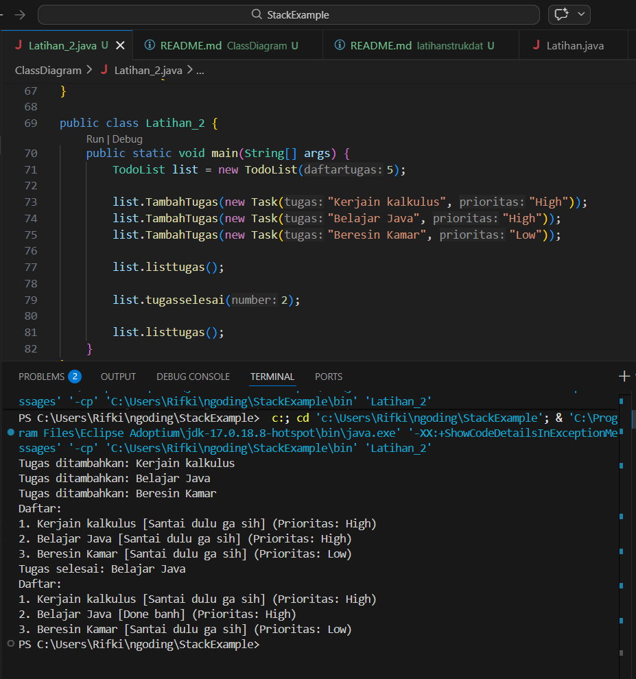

## Deskripsi Kasus
Program ini dibuat untuk membantu saya dalam mencatat daftar tugas sehari-hari.  
Program ini dapat:
- Menambahkan tugas
- Melihat daftar tugas
- Menandai tugas sebagai selesai

## Class Diagram
class Task {
    - tugas : String
    - selesai : boolean
    - prioritas : String
    + Task(tugas, prioritas)
    + getTugas() : String
    + Selesai() : boolean
    + getPrioritas() : String
    + cek() : void
}

class TodoList {
    - tasks : Task[]
    - count : int
    + TodoList(daftartugas)
    + TambahTugas(Task) : void
    + tugasselesai(int) : void
    + listtugas() : void
}

class Latihan_2 {
    + main(String[] args)
}

TodoList --> Task
Latihan_2 --> TodoList

## Kode Program JAVA
```java
class Task {
    private String tugas;
    private boolean selesai;
    private String prioritas;

    public Task(String tugas, String prioritas) {
        this.tugas = tugas;
        this.prioritas = prioritas;
        this.selesai = false;
    }

    public String getTugas() {
        return tugas;
    }

    public boolean Selesai() {
        return selesai;
    }

    public String getPrioritas() {
        return prioritas;
    }

    public void cek() {
        selesai = true;
    }
}

class TodoList {
    private Task[] tasks;
    private int count;

    public TodoList(int daftartugas) {
        tasks = new Task[daftartugas];
        count = 0;
    }

    public void TambahTugas(Task t) {
        if (count < tasks.length) {
            tasks[count] = t;
            count++;
            System.out.println("Tugas ditambahkan: " + t.getTugas());
        } else {
            System.out.println("TUGAS JANGAN DITUMPUK!");
        }
    }

    public void tugasselesai(int number) {
        int index = number - 1; 

        if (index >= 0 && index < count) {
            tasks[index].cek();
            System.out.println("Tugas selesai: " + tasks[index].getTugas());
        } else {
            System.out.println("MASA BELOM ADA YANG SELESAI!!!");
        }
    }

    public void listtugas() {
        System.out.println("Daftar:");
        for (int i = 0; i < count; i++) {
            String status = tasks[i].Selesai() ? "Done banh" : "Santai dulu ga sih";
            System.out.println((i + 1) + ". " + tasks[i].getTugas() +
                " [" + status + "] (Prioritas: " + tasks[i].getPrioritas() + ")");
        }
    }
}

public class Latihan_2 {
    public static void main(String[] args) {
        TodoList list = new TodoList(5);

        list.TambahTugas(new Task("Kerjain kalkulus", "High"));
        list.TambahTugas(new Task("Belajar Java", "High"));
        list.TambahTugas(new Task("Beresin Kamar", "Low"));
        
        list.listtugas();

        list.tugasselesai(2); 

        list.listtugas();
    }
}
```
## Output


## Penjelasan prinsip-prinsip OOP apa saja yang diterapkan
1. Encapsulation (Enkapsulasi)

Encapsulation adalah konsep membungkus data (atribut) dan method dalam satu class, serta membatasi akses langsung ke data tersebut.
```java
private String tugas;
private boolean selesai;
private String prioritas;
```
Agar tetap bisa diakses, gunakan method publik seperti:
```java
public String getTugas()
public boolean Selesai()
```
2. Abstraction (Abstraksi)

Abstraction adalah menyembunyikan detail implementasi dan hanya menampilkan fungsi penting kepada pengguna.
```java
tasks[index].cek();
```
method tersebut digunakan untuk menandai tugas sebagai selesai, tanpa perlu tahu detail internalnya, yaitu:
```java
selesai = true;
```
Hal ini membuat program lebih sederhana dan mudah digunakan.

3. Composition (HAS-A Relationship)

Composition adalah hubungan di mana suatu class memiliki objek dari class lain.
```java
private Task[] tasks;
```
Artinya, class TodoList memiliki kumpulan objek Task.
Relasi ini menunjukkan bahwa TodoList berperan sebagai pengelola banyak tugas.

## Penjelasan keunikan yang membedakan dengan individu lain
1. Validasi Kapasitas Array
Program tidak hanya menambahkan tugas, tetapi juga melakukan pengecekan kapasitas:
```java
if (count < tasks.length)
```
Jika penuh:
"TUGAS JANGAN DITUMPUK!"

Ini menunjukkan adanya pengamanan sederhana terhadap overflow.

2. Adanya Sistem Prioritas
Setiap tugas yang ditambahkan memiliki atribut prioritas:
```java
private String prioritas;
```
Walaupun masih sederhana (High/Low), fitur ini sudah menunjukkan adanya konsep prioritas tugas yang harus dikerjakan.